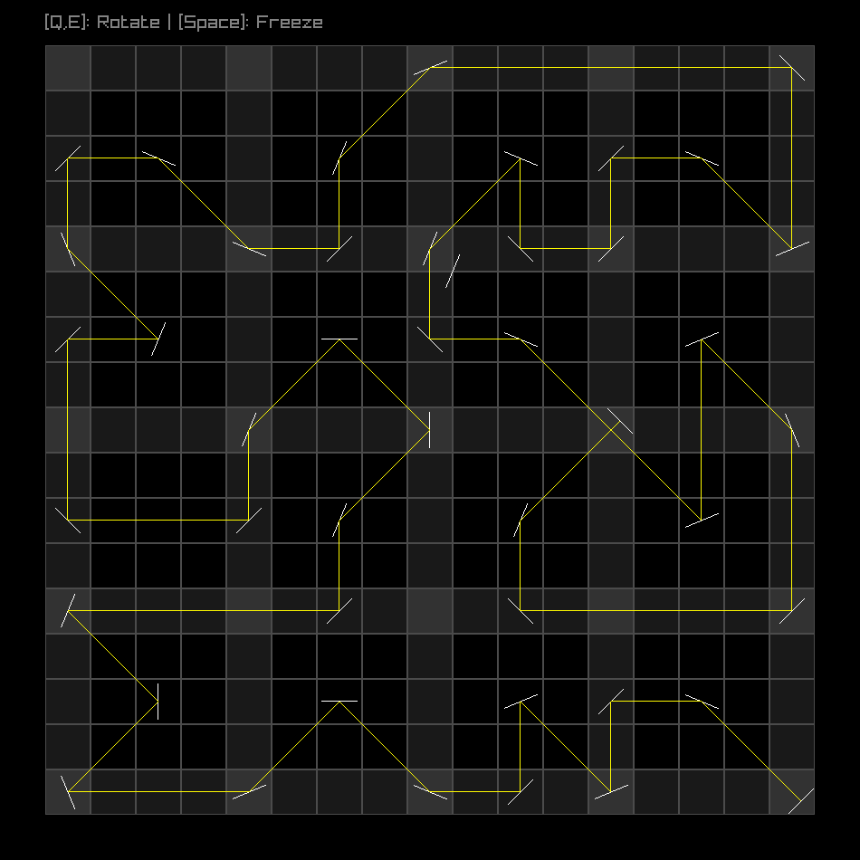

# Hall of Mirrors 2

https://www.janestreet.com/puzzles/hall-of-mirrors-2-index/



## Notes

Some geometry code is adapted from `gloss` ([hackage](https://hackage.haskell.org/package/gloss),
[git](https://github.com/benl23x5/gloss)) to support operations on `(Fractional a) => V2 a` from
`linear`.

This code is found in [FractionalOps.hs](./app/FractionalOps.hs) and licensed as follows:

```
Copyright (c) 2010-2016 The Gloss Development Team

 Permission is hereby granted, free of charge, to any person
 obtaining a copy of this software and associated documentation
 files (the "Software"), to deal in the Software without
 restriction, including without limitation the rights to use,
 copy, modify, merge, publish, distribute, sublicense, and/or sell
 copies of the Software, and to permit persons to whom the
 Software is furnished to do so, subject to the following
 condition:

 The above copyright notice and this permission notice shall be
 included in all copies or substantial portions of the Software.
```

See https://hackage.haskell.org/package/gloss-1.13.2.2/src/LICENSE.
